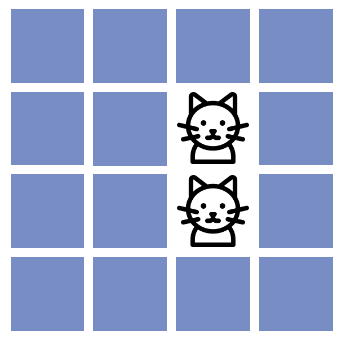

<h1>PAIRS - MEMORY GAME!</h1>

<div>Pairs memory game is made to help you practice and increase your attention span, concentration, and critical thinking in a fun way. Memory games are proven to help to develop long-term memory and visual recognition for kids. You can play this game alone or with family or friends and see who can get all the pairs in the least amount of moves!</div>
<br>
<div>The game can be accessed through this <a href="https://https://alvalind.github.io/project-2-memory-game/" target="_blank">LINK</a></div>
<br>


 <h2> Features </h2>
<ul>Heading and Instructions
  <ul><li>The heading presents the name of the game in a clear font and color that matches the game.</li>
    <li>The instructions are short, clear, and placed in the top center of the game area, right under the heading.</li>
    
  </ul>
  </ul>
<ul>The Tallies
  <ul> <li>The tallies keep track of the number of moves each player has made and their total number of pairs. This is so the user can challenge themselves to get all the pairs in as few moves as possible</li>
  </ul>
</ul>
<ul> The restart button
  <ul><li>The restart button is hidden during the game. Once you find all 8 pairs in the game and the pop-up message "Congratulations you found all pairs" has been shown the button appears in the center of the game board to prompt the user to play again. When clicking the restart button the user pairs and scores tallies are set back to zero, the game board is reset and the cards are shuffled and placed in a new random order on the game board.</li>
</ul>
</ul>
<ul>Favicon
  <ul><li>The game has a puzzle piece favicon to make the game more userfriendly</li></ul>
  
</ul>
<ul>Card Animation
  <ul><li>Each card has a rotation effect when revealing the content behind it to give the illusion of a card flip.</li>
  </ul>
</ul>
<ul>Alert message
  <ul><li>When players find all of the 8 card pairs a pop-up message appears.</li>
  </ul>
</ul>
<ul>Footer
  <ul><li>The footer includes the name of the game, copyright info, and the name of the creator.</li></ul>

</ul>
</ul>

<br>
<h2>Technologies Used</h2>
<ul>
  <li><a href="https://developer.mozilla.org/en-US/docs/Web/HTML" target="_blank">HTML</a> was used as the foundation of the site.</li>
  <li><a href="https://developer.mozilla.org/en-US/docs/Web/css" target="_blank">CSS</a> was used to add the styles and layout of the site.</li>
  <li><a href="https://developer.mozilla.org/en-US/docs/Learn/CSS/CSS_layout/Flexbox" target="_blank">CSS Flexbox</a> was used to arrange items simmetrically on the pages.</li>
  <li><a href="https://codeanywhere.com/" target="_blank">Codeanywhere</a> was used as the main tool to write and edit code.</li>
  <li><a href="https://git-scm.com/" target="_blank">Git</a> was used for the version control of the website.</li>
  <li><a href="https://github.com/" target="_blank">GitHub</a> was used to host the code of the website.</li>
</ul>
<br>
<h2>Design</h2>
<ul>
  <ul>
    <li>Colours
      <ul>
        <li>A cool light pink has been used as the background color of the game's website to give the player a calm feeling while playing the memory game without anything distracting in the background.</li>
        <li>The game cards have a darker cool blue color to stand out on the screen.</li>
        <li>The instructions and "play again" button have a more colorful violet color to draw the player's attention. </li>
      </ul>
    
  </ul>
</ul>
<h2>Font</h2>
<ul>Lexend
<ul>
  <li>Lexend was used as the font for all the text including the header, instructions, tallies, restart button, and footer.</li>
  <li>The font was picked because of its readability and it aligns with the overall style and theme of the memory game and the images in the game.</li>
</ul> 

</ul>
<br>
<h2>Testing</h2>
<ul>
  Compatibility. The game has been played and tested on the browsers: Chrome, Firefox, and Safari.
  <br>
    <ul>
    <li>Chrome:</li>
      
      <li>Firefox:</li>
      
      <li>Safari:</li>
      
    </ul>
  </ul>
  <ul>Responsiveness
  <ul>
    <li>The responsiveness of the game was checked in devtools that are available in Chrome browsers. The below image showcases the responsiveness and has been made through <a href="https://responsiveviewer.org/" target="_blank">responsiveviewer.org</a></li>
    
  </ul>
  </ul>
  <ul>Validator testing
    <ul>HTML
      <ul>
        <li>There were no errors but unfortunately, one warning in the HTML when testing it through W3C validator. The warning is because the section with the instructions lacks a heading on row 56.</li>
        
      </ul>
    </ul>
    <ul>CSS
      <ul>
        <li>No errors or warnings were found when testing the game through the W3C (Jigsaw) validator</li>
      
      </ul>
    </ul>
    <ul>JavaScript
      <li>No errors were found when testing the javascript code in the JavaScriptValidator JsHint</li>
    </ul>
    <ul>
      LightHouse
      <ul>
        <li>Through using lighthouse in devtools I checked that the game is performing well in accessibility, performance, SEO, and Best Practices.
        </li>
      </ul>
    </ul>
  </ul>
<br>
<h2>Bugs</h2>
<ul>Solved bugs
  <ul>
    <li> There was previously a bug in the game when the player clicked on the cards too quickly. When clicking on the cards too quickly the game stopped working and froze. I solved this bug by adding event.preventDefault to row 115 of my javascript. I am aware that there is a better solution for this bug however, due to lack of time I decided to leave the code as it is for future improvements. See the code below
     <p>```js
     card.addEventListener('click', function (event) {
            event.preventDefault();
            const revealedCards = document.querySelectorAll('.revealCard');
            if (revealedCards.length === 2 || revealedCards.length > 2) {
            } else {
                handleCardClick(event);
            }
      ```</p></li>
    <li>I also had a bug where the moves and pairs tallies did not update the last round before the alert text with the congratulations popped up. I solved this by moving my alert message code and adding a time delay between the game completion and the alert being displayed. As a result, the tallies can update to display the final pairs and moves before the alert appears.
    <p>```js
    function checkIfGameComplete() {
    let totalPairs = shuffled_cards.length / 2;
    if (pairs === totalPairs) {

        setTimeout(function () {
            alert('Congratulations! You found all the pairs!');
            document.getElementById('playAgainButton').style.display = 'block';
        }, 500);
    }
  }
  ```</p></li>
  </ul>
</ul>
<h2>Mistakes</h2>
<ul>
<li>Some code should be better formatted but due to the build of Codeanywhere I can't avoid this right now. I will look into solutions for the future and if there is another coding software that I can use.</li>
<li>I am aware that my commit messages are not up to standard. I am committed to significantly improving them for my next project.</li>
</ul>
<br>
<h2>Deployment</h2>
<ul>Deployment to GitHub Pages
<li>The site was deployed to GitHub pages. The steps to deploy are as follows: <ul>
<li>In the <a href="https://github.com/AlvaLind/project-2-memory-game" target="_blank">GitHub repository</a>, navigate to the Settings tab</li>
<li>From the source section drop-down menu, select the Main Branch, then click "Save".</li>
<li>The page will be automatically refreshed with a detailed ribbon display to indicate the successful deployment.</li>
</li>
</ul>
<br>
<p>You can find the link <a href="https://alvalind.github.io/project-2-memory-game/" target="_blank">HERE.</a></p>

